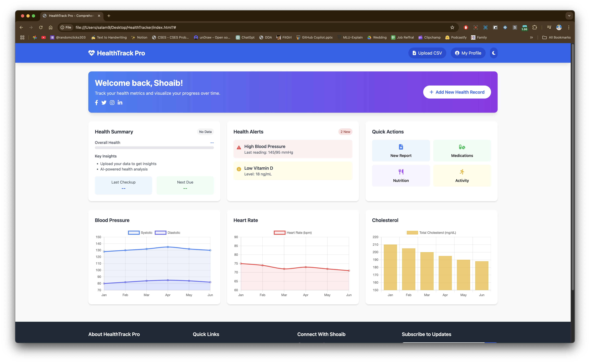
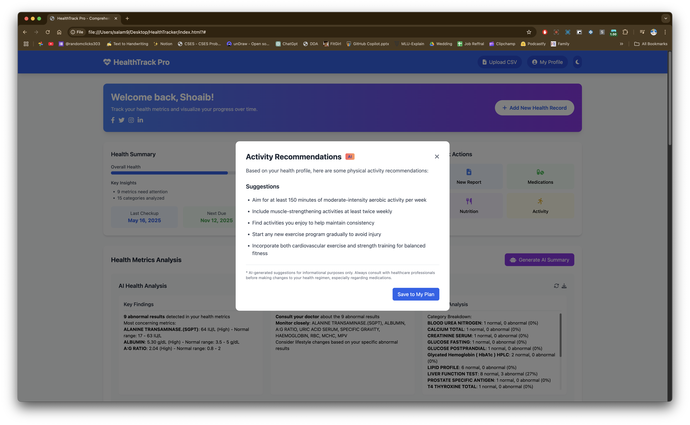
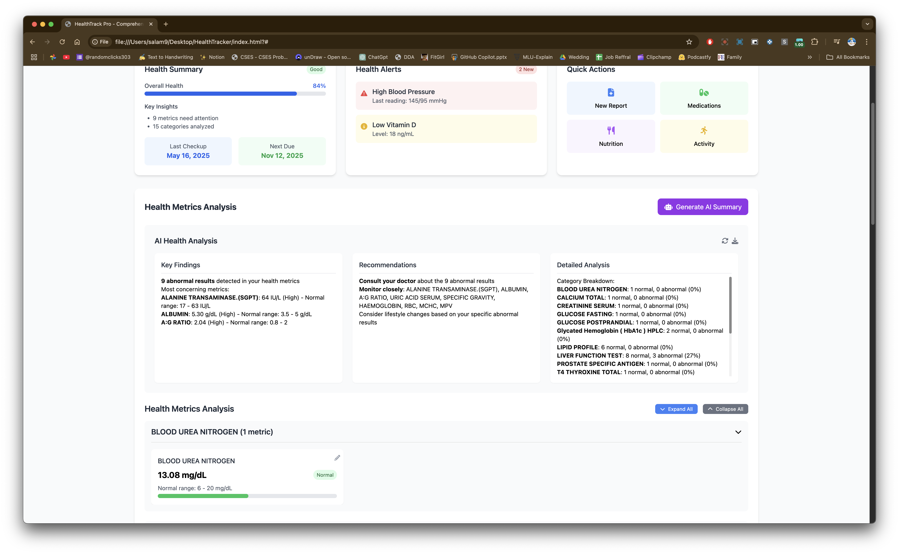
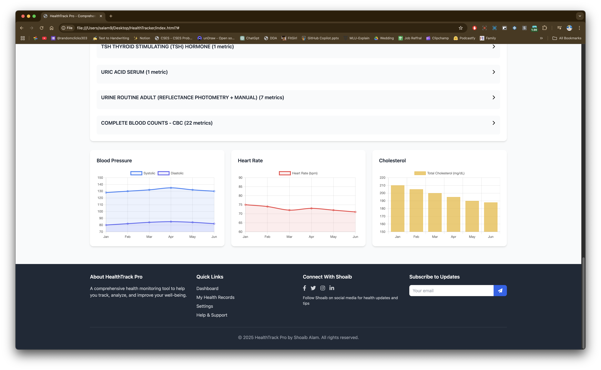
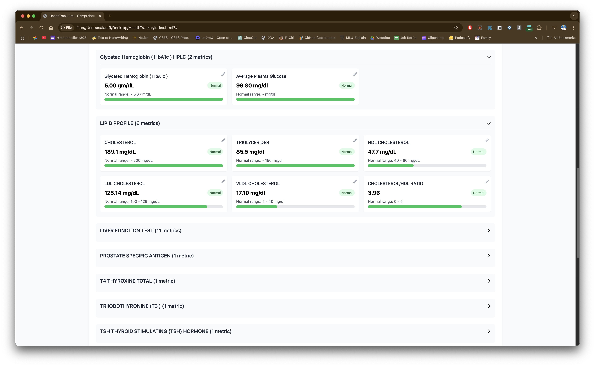

# HealthTrack Pro

A comprehensive health tracking application that visualizes and analyzes personal health data from various sources, including medical reports and CSV files.








## Features

- **Health Data Upload**: Upload your health reports in CSV format
- **Data Visualization**: Interactive charts for key health metrics 
- **Health Summary**: AI-powered insights about your health trends
- **Key Findings**: Highlights important aspects of your health reports
- **Export Functionality**: Export reports and visualizations

## Technologies Used

- HTML5, CSS3, JavaScript (ES6+)
- [Chart.js](https://www.chartjs.org/) for data visualization
- [Tailwind CSS](https://tailwindcss.com/) for responsive UI components
- [Marked.js](https://marked.js.org/) for Markdown rendering
- [Font Awesome](https://fontawesome.com/) for icons

## Setup and Installation

1. Clone the repository:
   ```bash
   git clone https://github.com/yourusername/HealthTracker.git
   cd HealthTracker
   ```

2. Configure environment variables:
   - Create a `.env` file in the root directory
   - Add your Databricks API credentials (if using the AI analysis feature):
     ```
     DATABRICKS_TOKEN=your_token_here
     DATABRICKS_BASE_URL=your_databricks_url_here
     ```

3. Run the application:
   - Open `index.html` in your browser or use a local server
   - For a simple local server, you can use Python:
     ```bash
     python -m http.server
     ```
   - Then open `http://localhost:8000` in your browser

## Data Privacy

This application processes health data locally in your browser. No personal health information is sent to external servers except when using the optional Databricks AI analysis feature. 

To ensure privacy:
- Sample data files are provided for demonstration but should be replaced with your own data
- Sensitive data files are excluded from Git via `.gitignore`
- Use environment variables for API keys and tokens

## Contributing

Contributions are welcome! Please feel free to submit a Pull Request.

## License

This project is licensed under the MIT License - see the LICENSE file for details.

## Acknowledgments

- Health data structure based on standard medical reporting formats
- UI design inspired by modern healthcare dashboards
